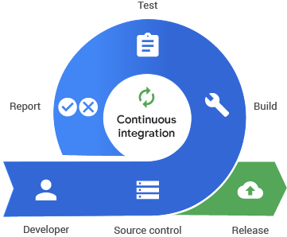
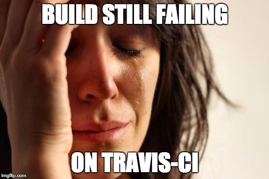

```{r setup, include=FALSE, message=FALSE}
options(htmltools.dir.version = FALSE)
library("jrPresentation")
set_presentation_options()
knitr::opts_chunk$set(cache = FALSE)
```


layout:true
`r add_border(inverse=FALSE)`

---

# Jumping Rivers

.pull-left[
</img>
]


.pull-right[


* On-site training (RSS accredited)

* R and python consultancy

* Dashboard creation

* Code review

* Continuous integration

* RStudio full service certified partners

* System architecture

* R Package development

* Predictive analytics
  ]
  
---

# Our clients

<div id="clients">
</img></img>
</img></img>
</img></img>
</img></img>
</img></img>
</img>
</img>
</div>

---

# Hands up... `r emo::ji("raising_hand_woman")`

* If you've written an R package before?

--

* If you've written a test before?

--

* If you've used version control before?

--

* If you've used continuous integration before?

---

# Git Refresher


---

class: center 

#  Make a small changes and integrate often





---


# Why use CI?


* Get daily constant feedback `r emo::ji("repeat")`

* Catch bugs early `r emo::ji("bug")`

* Avoid the monster commit `r emo::ji("japanese_ogre")`

* You don't have to remember to run `devtools::check()` `r emo::ji("person_facepalming")`
---

# Travis?

.pull-left[

* A hosted continuous integration service

* Used to build and test software projects hosted at GitHub

* Essentially a push to GitHub, triggers another job

* This job could be anything 
]

.pull-right[
</img>
]


---

# How to set it up?

* Host your R package on GitHub

* Create a `.travis.yml` file `usethis::use_travis()`

* Go to travis-ci.org to link your GitHub account with travis

* Turn on ci for your project by switching the button

--

```{r, eval = FALSE}
> usethis::use_travis()
✔ Setting active project to '/home/rhian/Documents/presentations/2019-11-16-trust-your-pkg'
✔ Writing '.travis.yml'
✔ Adding '^\\.travis\\.yml$' to '.Rbuildignore'
● Turn on travis for your repo at https://travis-ci.org/profile/trianglegirl
```

---

# An example `travis.yml` file


```{}
language: r
cache: packages
```

--

```{}
r:
  - oldrel
  - release
  - devel
```

--

```{}
notifications:
  email:
    recipients:
     - alerts@jumpingrivers.support
    on_success: change
    on_failure: change
```

---

class: center

# What jobs can you run on Travis?


---


# Badge-tastic

[](https://travis-ci.org/jr-packages/jrIntroduction)


```{}

[](https://travis-ci.org/jr-packages/jrIntroduction)

```
  
---

class: center, middle, inverse


---

class: center, middle, inverse


---

class: center, middle, inverse


---

class: center, middle, inverse


---

class: center, middle, inverse


---

class: center, middle, inverse


---

# Jumping Rivers and CI 

* R training notes `r emo::ji("book")`
  * Spell check
  * Full stops
  * Up-to-date packages
  * Dead links

* Our R packages `r emo::ji("package")`
  * Standard package check 
  * Lintr styling
  * Sensible file names

---

# Note check demo

```
◉ Comparing to master
◉ Checking template files
◉ Checking package versions
◉ Spell check (experimental)
◉ Checking chapters for title case
◉ Checking section for sentence case
◉ Checking for full stops
◉ Checking for undefined citations
◉ Checking for duplicate labels
◉ Checking for undefined refs
◉ Checking URLS
◉ Checking lint
◉ Checking version in config.yml
◉ Checking for uncommitted 
✔ Everything committed!
★ ★ You are fabulous! ★ ★
```
---

# inteRgrate `r emo::ji("package")`

* We wanted to **simplify** and **standardise** the way we use CI

* Create functions which will work on GitHub, GitLab and in R

* Specify the exact number of NOTES and WARNINGS we allow

* Include additional checks


---

# Main functions of inteRgrate `r emo::ji("heavy_check_mark")`

  * `check_pkg()`
  * `check_r_filenames()`
  * `check_tidy_description()`
  * `check_lintr()`
  * `check_namespace()`

```{}
inteRgrate::check_lintr()
◉ Checking lint...check_lintr()
◉ Checking vignettes
..........
✔ Lint looks good
```
  

---

# Summary 

.pull-left[

* Use continuous integration `r emo::ji("heavy_check_mark")`

* Don't get upset when it fails `r emo::ji("weary")`

* Feel happy you've taken a step toward more robust code `r emo::ji("lock")`

* Chat to us if you need help `r emo::ji("email")`


#### Resources
* [inteRgrate](https://github.com/jumpingrivers/inteRgrate)
* [usethis](https://usethis.r-lib.org/)
* [tic](https://github.com/ropenscilabs/tic)
* [Julia's blogpost](https://juliasilge.com/blog/beginners-guide-to-travis/)
* [GitHub PAT](https://itsalocke.com/blog/using-travis-make-sure-you-use-a-github-pat/)

]

.pull-right[

]