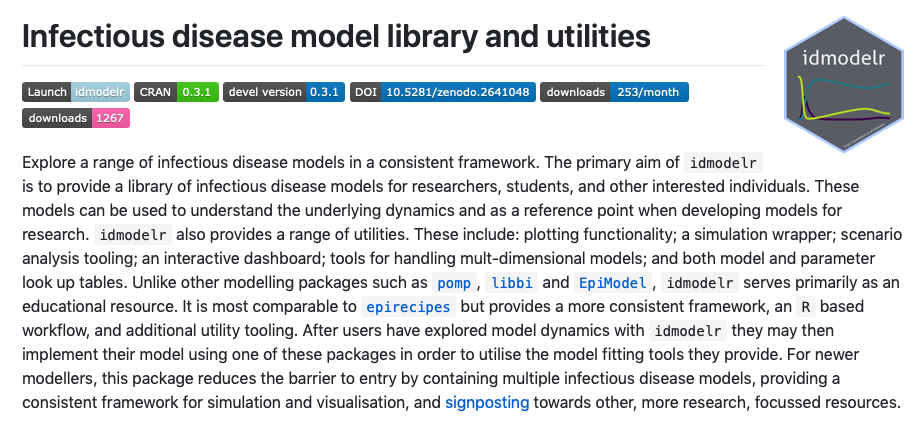
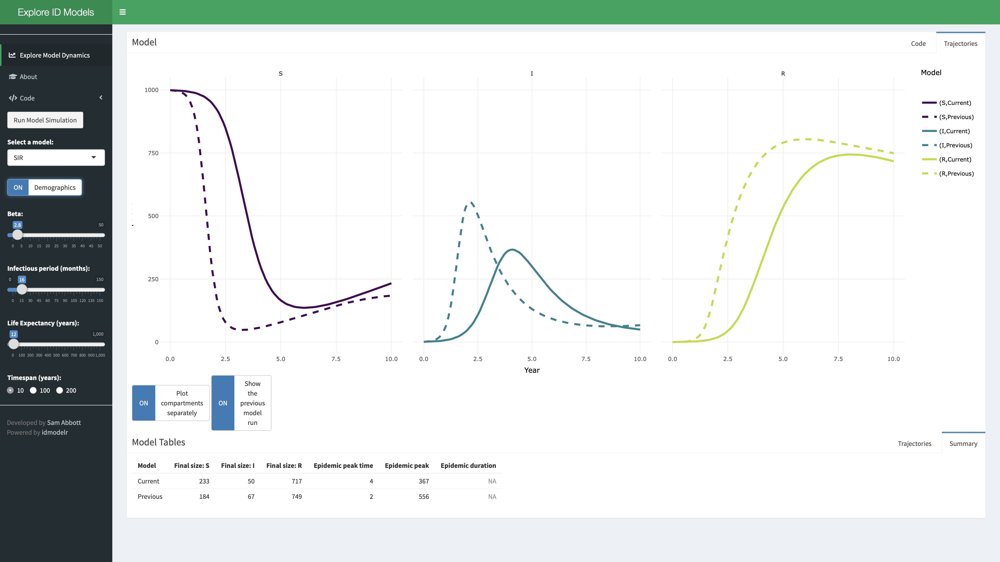
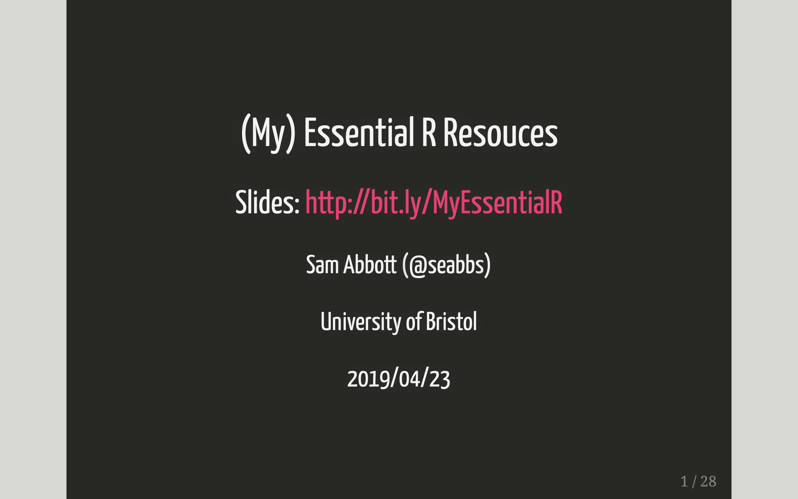
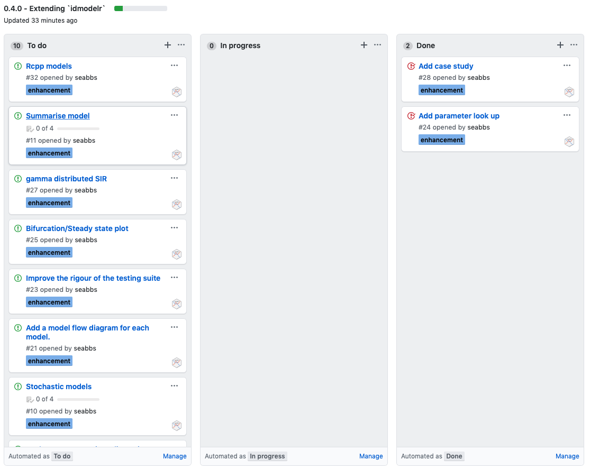
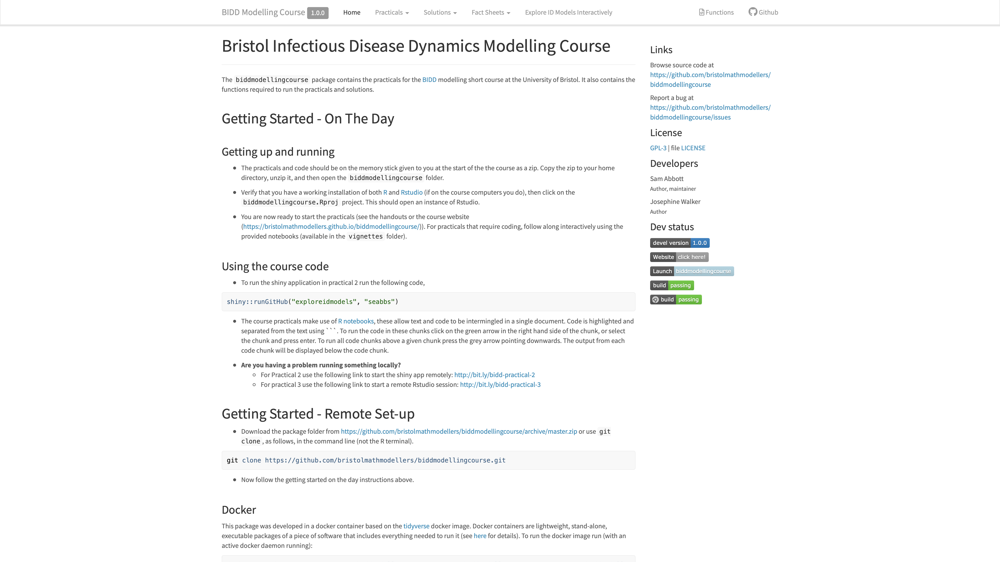
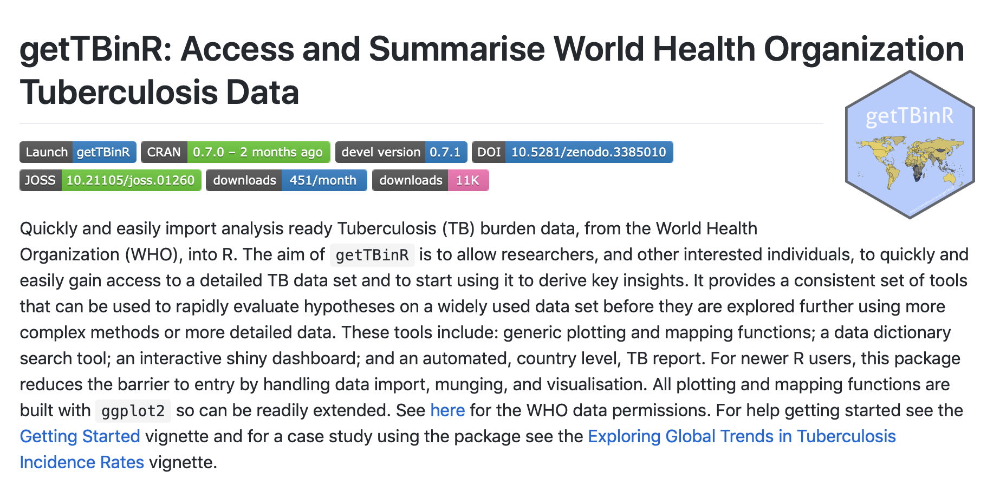
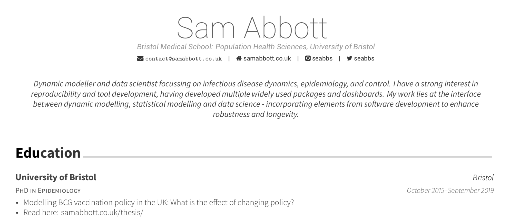

```{r setup, include=FALSE}
options(htmltools.dir.version = FALSE)

knitr::opts_chunk$set(echo = TRUE, dpi = 330, fig.align = 'center', dev = 'svg')

library(idmodelr)
library(tidyverse)
library(knitr)
```

# [`{idmodelr}`](http://bit.ly/idmodelr)<sup>1, 2</sup>

```{r, echo = FALSE, fig.height = 5}

```

.footnote[
[1] Package Docs: [bit.ly/idmodelr](https://bit.ly/idmodelr), 
[2] JOSS draft paper: [bit.ly/idmodelr-paper-draft](https://bit.ly/idmodelr-paper-draft)
]

---
class: center, middle, inverse

# Slides: [bit.ly/idmodelr-satrday-cardiff](https://bit.ly/idmodelr-satrday-cardiff)

# `{idmodelr}`: [bit.ly/idmodelr](https://bit.ly/idmodelr)

# Dev Environment: [bit.ly/idmodelr-binder](https://bit.ly/idmodelr-binder)


---
class: inverse

# Outline

## 1. Who am I?

## 2. Why?

## 3. What?

## 4. How?

## 5. Future development

## 6. Wrap up

---
class: center, middle, inverse

# Who am I?

---

# Who am I?

* **Postdoctoral researcher:** Infectious disease dynamics.<sup>1</sup>

* **PhD:** Modelling tuberculosis and the optimal usage of the BCG vaccination.<sup>2</sup>

* **Previously:** Mathematics, theoretical physics, applied mathematics, and data science in finance.

* **Sideline:** Open source software, reproducibilty + hounding people on the internet about reproducibility.

* **Currently:** Job hunting.

.footnote[
[1] More detail here: [https://www.samabbott.co.uk](https://www.samabbott.co.uk/)

[1] Thesis (in bookdown): [bit.ly/seabbs-thesis](http://bit.ly/seabbs-thesis)
] 

---
class: center, middle, inverse

# Why?

---

# Why - domain area motivation

* Infectious disease models increasingly used by public health researchers but require a different knowledge base to other tools.

* Many resources exist for teaching theory but the R infectious disease modelling landscape is fragmented.

* Some modelling tasks are repetitive - these can easily be automated.

* Most tools focus on complex research usage. Examples:  [`pomp`](https://kingaa.github.io/pomp/), [`libbi`](http://libbi.org) and [`EpiModel`](http://www.epimodel.org).

* Several tools - notably [`{modelbuilder}`](https://github.com/ahgroup/modelbuilder) and [`{DSAIDE}`](https://ahgroup.github.io/DSAIDE/) - focus on teaching modelling dynamics. 

* Most comparable to [`epirecipes`](http://epirecip.es/epicookbook/chapters/simple). 
---

# Why a `r emo::ji('package')`?


* A consistent framework on which to build.

* Tools to check the robustness of code (unit tests).

* Makes accessing models much easier and more consistent.

* Provides assurance that all models can be run in a single environment.

* Allows for tools to be developed alongside models to decrease the effort involved in modelling. 

* Documentation on modelling can be provided alongside working, repurposable code examples.

---
class: center, middle, inverse

# What?

---

#Overview

* Library of infectious disease models (currently deterministic compartmental only - see future work).

* Easy to use (and robust) plotting and model summaries.

* Model and parameter look-up tables.

* Tools for scenario analysis.

* Still in active development with more models, tools, and docs in the pipeline.

---
class: center, middle, inverse

# Quick start


---

#0. Install

## Install the CRAN version

```{r cran-installation, eval = FALSE}
install.packages("idmodelr")
```

## Alternatively install the development version

```{r gh-installation, eval = FALSE}
# install.packages("devtools")
devtools::install_github("seabbs/idmodelr")
```

---

# 1. Find a model


```{r}
library(dplyr)
library(idmodelr)

idmodelr::model_details %>% 
  dplyr::filter(model_family %in% "SIR")
```

.footnote[
Alternatively explore online: [samabbott.co.uk/idmodelr/articles/model_details.html](https://www.samabbott.co.uk/idmodelr/articles/model_details.html)
]

---

# 2. Check the model implementation

Look at the model + the help file (`?SIR_demographics_ode`).

```{r}
idmodelr::SIR_demographics_ode
```


---

# 3. Check the parameters

```{r}
parameters <- idmodelr::required_parameters("SIR_demographics_ode")

parameters
```

.footnote[
Alternatively explore online: [samabbott.co.uk/idmodelr/articles/parameter_details.html](https://www.samabbott.co.uk/idmodelr/articles/parameter_details.html)
]

---


# 4. Parameterise the model

```{r}
parameters <- data.frame(
  beta = 3, ##Transmission rate = contact rate * transmission probablity
  tau = 0.5, ## Rate recovcery = 1 / duration of infection
  mu = 1/81 ## Natural birth/death rate = 1 / average lifespan
)
```

# 5. Initialise the model

```{r}
inits <- data.frame(
  S = 999,
  I = 1,
  R = 0
  )
```

---

# 6. Simulate the model

```{r}
## Model timespan
times <- seq(0, 50, 0.1)

## Simulate model as an ODE
traj <- idmodelr::simulate_model(model = SIR_demographics_ode,
                                 sim_fn = idmodelr::solve_ode, ##as solving an ode
                                 inits = inits,
                                 params = parameters,
                                 times = times)


head(traj, n = 5)
```

---

# 7. Summarise (WIP)


```{r}
idmodelr::summarise_model(traj) %>% 
  knitr::kable(format = "html")
```

---

# 8. Plot (WIP)

```{r, out.width = "60%"}
idmodelr::plot_model(traj, facet = FALSE)
```

---

# 9. Vary parameters and simulate

```{r}
parameters_up <- parameters
parameters_up[["mu"]] <- 1 / 20


traj_up <- idmodelr::simulate_model(
  model = idmodelr::SIR_demographics_ode,
  sim_fn = idmodelr::solve_ode,
  inits, 
  parameters_up,
  times)

head(traj_up, n = 5)
```

---

# 10. Compare models

```{r, out.width = "60%"}
idmodelr::plot_model(traj, traj_up, facet = TRUE)
```

---
class: center, middle, inverse

# More here: [bit.ly/idmodelr](http://bit.ly/idmodelr)

---

class: center, middle, inverse

# Not feeling like coding?

---

# `{shiny}` dashboard

```{r, eval = FALSE}
#install.packages("shiny")
#warning (eeek) this will install packages without a prompt on your system!
shiny::runGitHub("exploreidmodels", "seabbs")
```

```{r dashboard-img, echo = FALSE, out.width = "80%"}

```

---
class: center, middle, inverse

# How?

---

# Overview

* Simple code using the `{tidyverse}`,`{ggplot2}` + other `r emo::ji('package')`s.

* Package building tools including: `{devtools}`, `{usethis}`, `{testthat}`, `{vdiffr}`, and `{pgknet}`.

* R packages<sup>1</sup> by Hadley Wickham.

* Other `r emo::ji('tool')`s: git, Travis CI, Appveyor, codecov.io etc.

* Copying `{dplyr}`<sup>2</sup> religiously ......

* Aiming for peer review by the Journal of Open Source Software<sup>3</sup> from the get go.

.footnote[
[1] R packages `r emo::ji('book')`: http://r-pkgs.had.co.nz, [2] `{dplyr}`: https://github.com/tidyverse/dplyr,
[3] JOSS : https://joss.theoj.org/about
]

---

# More detail

```{r, out.width = "90%", echo = FALSE}

```

.footnote[
[1] Slides: http://bit.ly/MyEssentialR
]

---
class: center, middle, inverse

# Future development

---

# Planned features

* Additional models including: non-exponentially distributed, disease vector models, age stratified models, and many more.

* Stochastic implementations of models (plus more tooling to support).

* Models implemeneted using `Rcpp`, `LibBi` and `Stan`.

* S3 plot and summary methods.

* Model diagrams.

* Extending documentation and case studies.

* Streamlining and improving package tools (in particular scenario analysis tooling).

* Improving links with model fitting packages and post-processing packages (i.e cost effectiveness).

---

# Please join in<sup>1</sup>!

```{r, out.width = "70%", echo = FALSE}

```

.footnote[
[1] Issues: [github.com/seabbs/idmodelr/issues](https://github.com/seabbs/idmodelr/issues)
]
---
class: center, middle, inverse

# Why join in? 

---
class: center, middle, inverse

## [`{idmodelr}`](http://bit.ly/idmodelr) = maths + data + #rstats + a global (preventable) issue

## -> [`{idmodelr}`](http://bit.ly/idmodelr) = the best thing since sliced bread<sup>*</sup>

.footnote[
\* *Warning: This is not real maths.*
]


---

# Why join in? 

* `{idmodelr}`  contains perhaps the simplest possible code for understanding infectious disease models and so may be a good place to start learning more. 

* For subject area experts contributing may help link up the package with your work. 

* Contributing to packages is a great way to learn about package development. No domain knowledge is required.

* Heading towards a JOSS publication in 2020 - authorship up for grabs (a bribe for academics).

---

class: center, middle, inverse

# Wrap up

---

# Summary


**Why**

* Infectious disease models are widely used both by domain area experts and non-experts. 

* For non-experts, existing tooling and teaching material can be complex, difficult to get started with or fragmented.

* For experts, routine tasks can be easily automated.

**What**

* A library of infectious disease models. 

* Tools to use them.

* Documentation explaining what is going on.

* A `{shiny}` app to get users started quickly with no code.

* A focus on keeping model code simple, easy to find, and easy to modify.

---
class: center, middle, inverse

# Now for some advertising

---

## Introduction to infectious disease modelling course

```{r echo = FALSE, fig.height = 5, out.width = "95%"}

```


.footnote[
[1] Website: [bristolmathmodellers.github.io/biddmodellingcourse/](https://bristolmathmodellers.github.io/biddmodellingcourse/),

[2] Sign up: [http://bit.ly/bristol-idm-course](http://bit.ly/bristol-idm-course)
]

---

# `{getTBinR}`<sup>1</sup>

```{r echo = FALSE, fig.height = 5}

```

.footnote[
[1] `{getTBinR}`: [bit.ly/getTBinR](http://bit.ly/getTBinR)
]

---

# CV using `#rstats`<sup>1</sup>...

```{r echo = FALSE, fig.height = 5}

```

.footnote[
[1] CV: [bit.ly/seabbs-cv](http://bit.ly/seabbs-cv), Code: [github.com/seabbs/cv](https://github.com/seabbs/cv), Talk: [bit.ly/seabbs-CVinR](http://bit.ly/seabbs-CVinR)
]

---
class: inverse, center, middle

# Thanks for listening!

## Slides: [bit.ly/idmodelr-satrday-cardiff](http://bit.ly/idmodelr-satrday-cardiff)

## Code: [bit.ly/idmodelr-satrday-cardiff-code](http://bit.ly/idmodelr-satrday-cardiff-code)

## `r emo::ji('package')` : [bit.ly/idmodelr](http://bit.ly/idmodelr)

## `r emo::ji('mathematician')` : [bit.ly/seabbs](http://bit.ly/seabbs)

## Tweet at me: [@seabbs](https://twitter.com/seabbs)


